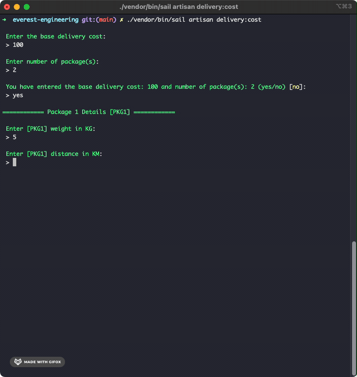
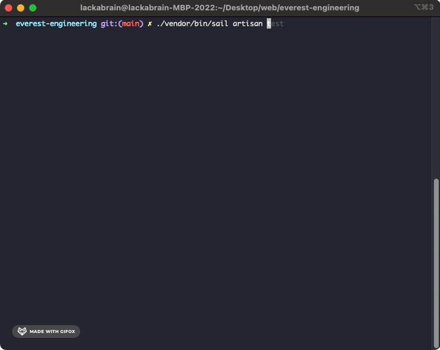

## Everest Engineering - Coding Challenge

## Background

**Kiki**, a first-time entrepreneur from the city of Koriko has decided to open a **small distance courier service** to deliver packages, with her friend Tombo and cat Joji.
Kiki has invested in **N** no. of vehicles and have **driver partners** to drive each vehicle & deliver packages.

## Problem 01
### Delivery Cost Estimation with Offers

Since it’s a new business, the team has decided to **pass coupons** around the town which will help them attract more customers.

### Pre-requisites
1. Only **one** offer code can be applied for any given package.
2. Package should meet the required mentioned **offer criterias**.
3. If offer code is **not valid/found**, discounted amount will be equal to 0.

### Offer Criteria
The offers can be used according to the criteria that Tombo has captured in this table. Discount will not be provided if no offer code is applied.

|                           | Distance (km) | Weight (kg) |
|---------------------------|:-------------:|:-----------:|
| **OFR001** (10% Discount) |     < 200     |  70 - 200   |
| **OFR002** (7% Discount)  |   50 - 150    |  100 - 250  |
| **OFR003** (5% Discount)  |   50 - 250    |  10 - 150   |

## Challenge / Question

You are required to build a command line application to estimate the **total delivery cost** of each package with an offer code (if applicable).

`Base Delivery Cost + (Package Total Weight * 10) + (Distance to Destination * 5) = Delivery Cost`

## Solution

I'm using Laravel Sail because it provides easy and a great starting point for building a Laravel application with Docker. So, it is easier to deploy without require prior Docker experience.

### Stack/Technology used
- PHP 8
- Laravel Sail

### Deployment

To deploy, clone the repository by running these commands:

```bash
  mkdir everest-engineering && cd everest-engineering
  git clone https://github.com/kanwarkamli/everest-engineering.git .
  ./vendor/bin/sail up
```

### Using the app

Once the containers are running:

```bash
  ./vendor/bin/sail artisan delivery:cost
```



### Adding new offer

Offer configuration can be found in `config/offer.php` file. Simply add a new set of offer configuration to add a new offer:

```
  'ofrXXX' => [
        'code' => 'OFRXXX',
        'discount' => 0.2,
        'min_distance' => 10,
        'max_distance' => 200,
        'min_weight' => 90,
        'max_weight' => 300,
    ]
```

### Testing
To run the test, execute the following command:

```bash
  ./vendor/bin/sail artisan test
```

